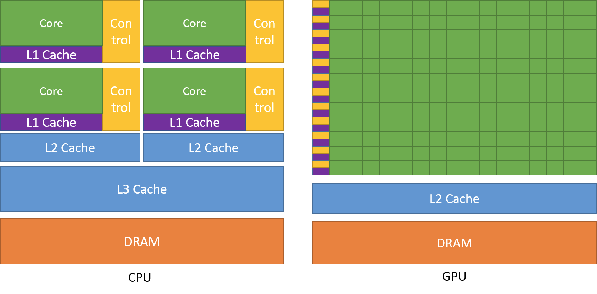

# Day 1: Introduction to GPU computing & CUDA

- **CPU Cores**: Optimized for fast, complex operations on fewer threads at once.
- **GPU Cores**: Designed for handling **thousands** of smaller, simpler threads, excelling at data-parallel operations
- **Core CUDA Concepts**
    - **Execution Model**
    - **Threads**: The smallest unit of parallel work. Each
    thread executes the same kernel (function), but on different data
    (Single Instruction, Multiple Thread approach).
    - **Blocks**: Group of threads that can share fast on-chip memory (called **shared memory**).
    - **Grid**: Collection of all blocks needed to solve your problem.

**Memory Hierarchy**

- **Global Memory**: Large but relatively slower; accessible by all threads.
- **Shared Memory**: A small, fast region local to each block.
- **Local/Private Memory**: Registers or thread-local storage.
- **Constant & Texture Memory**: Specialized for read-only data or caching.

**Kernel Functions**

- Marked with `__global__`, these are the functions you launch on the GPU.
- Kernel launches use the triple-angle-bracket syntax: `kernelName<<<blocks, threads>>>(...)`

## After writing the code, you can run it using the following command:
```bash
nvcc helloGPU.cu -o helloGPU
```
**This will compile the CUDA code into an executable named `helloGPU`.**
Then, you can run the executable with:
```bash
./helloGPU
```
## Further Important points from the Readings:
From the readings:
1. https://developer.nvidia.com/blog/easy-introduction-cuda-c-and-c/:
    - The CUDA programming model is a heterogeneous model in which both the CPU and GPU are used
    - Host (CPU) and Device (GPU) are the two main components.
    - Code run on the host can manage memory & launch the kernels on both the host and device.
    - Kernels are functions that run on the device (GPU) and can be launched from the host.
    - Kernels are executed by multiple threads in parallel.
    - CUDA C/C++ is an extension of C/C++ for programming NVIDIA GPUs.
    - It allows developers to write programs that execute on the GPU, leveraging its parallel processing capabilities.
    - The CUDA programming model is based on a hierarchy of threads, blocks, and grids.
    - **A typical sequence of steps in a CUDA program includes:**
        - Declare and allocate memory on the device.
        - Initialize data on the host.
        - Copy data from the host to the device.
        - Launch the kernel on the device.
        - Copy results back from the device to the host.
        - Free device memory.
        - Free host memory.
2. https://docs.nvidia.com/cuda/cuda-c-programming-guide/index.html
   - GPU has higher instruction throughput and memory bandwidth than the CPU.
   - CPU is optimized for low-latency access to a small number of threads, while GPU is optimized for high-throughput access to a large number of threads.
   - 
   - Devoting more transistors to data processing allows GPUs to excel at parallel tasks instead of relying on large caches.

**Kernel**
- A kernel is a function that runs on the GPU and is executed by multiple threads in parallel.
- CUDA C++ extends C++ with keywords to define kernels and manage memory.
- Kernels are launched from the host (CPU) and executed on the device (GPU).
- - A kernel is defined with the `__global__` qualifier, indicating it can be called from the host and executed on the device.
- The kernel launch syntax is `kernelName<<<blocks, threads>>>(...)`, where `blocks` is the number of blocks to launch and `threads` is the number of threads per block.
- Each thread executes the same kernel code but operates on different data, following the Single Instruction, Multiple Threads (SIMT) model.
- And each thread is given a unique thread ID, which can be used to access specific data elements.

**Thread Hierarchy**
- Threads are organized into blocks, and blocks are organized into a grid.
- ThreadIdx is as 3-component vector , so that threads can be identified using a one-dimensional, two-dimensional, or three-dimensional index forming a one dimensional, two-dimensional, or three-dimensional block of threads called a block of threads.
- This provides a natural way to invoke the computaions across the elements in a domain such as vectors, matrices, or volumes.
- The number of threads in a block is limited by the hardware, typically up to 1024 threads per block.
- The thread Id for a :
  - 1D block is `x`
  - 2D block is `x+y*Dx`
  - 3D block is `x+y*Dx+z*Dx*Dy`
  - where Dx,Dy and Dz are the dimensions of the block in the x,y and z directions, respectively.